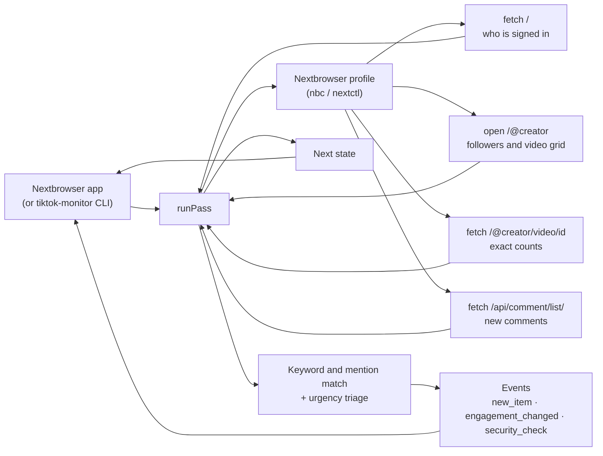

<p align="center">
  
</p>

<h1 align="center">Nextbrowser TikTok Monitoring</h1>

<p align="center">
  <strong>The open-source TikTok monitoring engine for Nextbrowser: new videos and comments from the creators you watch, comments on your own videos, mentions, keywords and engagement jumps, ranked by how urgently they need an answer, read from your own browser profile.</strong>
</p>

<p align="center">
  <a href="https://nextbrowser.com/">Website</a> ·
  <a href="https://github.com/nextbrowser-oss/nextbrowser-app">Nextbrowser app</a> ·
  <a href="https://docs.nextbrowser.com/">Product docs</a> ·
  <a href="docs/how-it-works.md">How it works</a> ·
  <a href="https://discord.com/invite/gHXEvkGXnz">Discord</a>
</p>

<p align="center">
  <a href="https://github.com/nextbrowser-oss/nextbrowser-tiktok-monitoring/actions/workflows/ci.yml"></a>
  <a href="LICENSE"></a>
  
  
  <a href="https://github.com/nextbrowser-oss/nextbrowser-app"></a>
</p>

<p align="center">
  English ·
  <a href="docs/i18n/ru/README.md">Русский</a>
</p>

<p align="center">
  
</p>

## Why Nextbrowser TikTok Monitoring

This package is the engine behind TikTok monitoring in [Nextbrowser](https://github.com/nextbrowser-oss/nextbrowser-app). It runs inside the app, on a browser profile that has tiktok.com open, and on every pass it answers four questions:

- who commented on your videos, replied to you, or mentioned you;
- what the creators you watch posted, and where your keywords came up under their videos;
- which videos are suddenly picking up views, likes or comments;
- which of all that needs an answer first.

It is open source because it works with your own profile and, when signed in, your own account. Anyone can read exactly which pages it opens, what it keeps from them, and how it decides what is urgent.

- **Read-only.** It never likes, comments, replies, follows or shares. It opens pages and reads them; nothing is clicked, typed or scrolled.
- **Works signed out.** A creator's page is public, so the creators you watch are read even when the profile is signed out. Signing in adds your own videos, the comments on them, and mentions of your account.
- **Explainable triage.** Six fixed rules rank every match *high*, *medium* or *low*, and each match carries the reasons in plain words. No model is involved and nothing leaves the machine.
- **Owned by the app.** The engine keeps no timers, files, or network connections of its own. Nextbrowser runs a pass, stores the state, and decides what to show.

## From a mention to an approved reply

Monitoring is one half of the TikTok skill in Nextbrowser. The other half is the TikTok reply agent:

| Step | Where | What happens |
| --- | --- | --- |
| 1. Mention and content detection | this engine | Your newest videos and the comments on them, each watched creator's new videos and the comments under them, matched against your keywords and your @handle as whole words. |
| 2. Urgency triage | this engine | Each match is ranked: mentions or replies to you, comments on your video, says an urgent term such as "refund" or "broken", asks a question, has no reply yet, or sits on a video picking up fast. |
| 3. Response drafting | Nextbrowser's TikTok reply agent | Choose **Draft reply** on a match. The agent opens the video, reads the comment and its context, and writes a reply to that specific comment, never a canned line. |
| 4. Approval mode | Nextbrowser's TikTok reply agent | The draft is shown to you in the chat first. Nothing is posted until you approve it, and you can edit or discard it instead. |

The engine stops at step 2 on purpose: whatever it finds, a person decides what gets said. The [walkthrough](docs/walkthrough.md) follows one comment through all four steps.

## Key features

| Area | What is available |
| --- | --- |
| Your videos | Your newest videos (6 by default) and every new comment on them, once the profile is signed in. A comment that opens with your @handle is a reply to you. |
| Creators | Up to 10 creators: competitors, partners, the accounts your customers watch. Every new video is reported; their newest videos (3 by default) are opened for exact counts and new comments. |
| Mentions and keywords | Your @handle anywhere in a comment or description. Up to 20 keywords or hashtags, matched case-insensitively as whole words ("acme" is found in "#acme", not in "#acmeshop"). Exclusion words drop the noise. |
| Engagement | A watched video's views, likes or comments jumping since the last look, past thresholds you set (+50% and at least 1,000 views by default). Follower counts of your account and each creator. |
| Urgency triage | *high*, *medium* or *low*, with the reasons, from rules you can read in [`src/triage.ts`](src/triage.ts). The urgent terms are a setting; they count only where the account is addressed or a keyword is named. |
| Degraded states | A captcha, a rate limit, a signed-out profile, a private or missing creator, a page that drew no grid, a comment list TikTok will not answer: each one gets a plain note, a summary flag and a [troubleshooting](docs/troubleshooting.md) entry, and the pass goes on where it can. |
| Embeddable core | `runPass(state) → { state, events, summary, matches }`, with no Node dependency, so it runs in the Nextbrowser renderer. |
| Standalone CLI | `tiktok-monitor` drives any Nextbrowser profile through `nbc`/`nextctl`, for development and for running without the app. |

## In Nextbrowser

Nextbrowser ships the engine as a dependency and gives it three things:

- the browser it already drives for the selected profile;
- a place to keep the state;
- a timer.

```ts
import { normalizeState, runPass, scheduleDelay, withSettings } from "@nextbrowser-oss/tiktok-monitoring";

const saved = withSettings(normalizeState(await load()), { creators: ["rivalwear"], keywords: ["acme", "#acmewear"] });
const { state, events, summary, matches } = await runPass({
  browser: cliBrowser(profileArgs),          // the app's nextctl-backed browser for the profile
  state: saved,
  onEvent: (event) => notify(event),         // new_item, engagement_changed, security_check, ...
});
await save(state);
show(matches);                               // most urgent first, with the reasons
setTimeout(next, scheduleDelay(30 * 60_000, { backOff: !!summary.blocked }));
```

The [integration guide](docs/integration.md) describes the contract between the app and the engine.

## Run it standalone

To develop the engine, or to run it without the app, use the bundled CLI. You need Node.js 22 or later and a Nextbrowser profile. The creators you watch are read signed out too; sign the profile in to tiktok.com for your own videos and mentions. The CLI uses the `nextctl` binary managed by the app, or `nbc` from your `PATH`.

```bash
git clone https://github.com/nextbrowser-oss/nextbrowser-tiktok-monitoring.git
cd nextbrowser-tiktok-monitoring
npm ci
npm run build
node dist/node/bin.js run --profile <your-profile> --creators <creator1>,<creator2> --keywords "<brand>,#<hashtag>"
```

What to expect:

1. The first pass records what every source holds as a starting line and announces nothing.
2. Each later pass prints new matches — the most urgent marked `HIGH`, with the reasons and the link — and waits about thirty minutes (`--interval`).
3. Stop it with <kbd>Ctrl</kbd>+<kbd>C</kbd>. The next run continues from the saved state in `~/.nextbrowser/tiktok-monitoring/<profile>.json`.

When you pipe the output to another program, it switches to JSON lines, one event per line. The [CLI reference](docs/cli-reference.md) lists every flag, and the [walkthrough](docs/walkthrough.md) runs through a first session step by step.

## How it works



Every pass does five things in order:

1. It puts the tab on tiktok.com and reads who is signed in.
2. It opens your own profile, when signed in, and reads your newest videos.
3. It opens each watched creator's profile and reads their grid.
4. For the newest videos it fetches their pages for exact counts, and reads the comment list of each one whose comment count grew.
5. It parks the tab.

The [how it works](docs/how-it-works.md) page explains the details:

- how an item is judged new, and why the first read announces nothing;
- why a comment list is read only when the count grew;
- every triage rule and its weight;
- what happens on a captcha, a rate limit, or a comment list TikTok will not answer.

## Documentation

- [Walkthrough](docs/walkthrough.md): a first session from setup to an approved reply, with real output.
- [How it works](docs/how-it-works.md): the pass step by step, freshness rules, keyword matching, urgency triage, engagement, degraded states.
- [Integration guide](docs/integration.md): the contract with the Nextbrowser app, the Node adapter, installing the package.
- [Events and state](docs/events-and-state.md): every event, the state document, and the settings.
- [CLI reference](docs/cli-reference.md): `tiktok-monitor` commands, flags, output, and exit codes.
- [Troubleshooting](docs/troubleshooting.md): a captcha, a rate limit, refused comment lists, a grid that never draws, profiles that will not start.

## Project status

This is an early release (`0.x`). Known limits:

- **Not yet verified live.** TikTok's web data is undocumented. The data block, the grid's `data-e2e` attributes and the comment list's shape follow what tiktok.com's web app is known to serve, and every read is covered by tests against stand-in pages of those shapes, but none of it has been run against tiktok.com from this package yet. Expect the first live runs to need fixes; the [troubleshooting](docs/troubleshooting.md) page says what to capture.
- **Comments may be refused.** TikTok's web app signs its comment-list calls. The monitor makes the call plainly, and TikTok may answer it with nothing. Then comments are skipped for the pass with a note, and the rest of the monitoring goes on.
- **No search of all TikTok.** Search needs signed calls and draws captchas quickly, so the monitor does not search. It watches the creators where your conversation happens instead.
- **The first 20 comments.** A comment list is read one page deep, in TikTok's own order, which is not newest first. On a very busy video a new comment can be missed.
- **Comments have no links of their own.** TikTok has no stable link to a single comment, so a comment's link is the video it is under.

Proposals and bugs go to [GitHub Issues](https://github.com/nextbrowser-oss/nextbrowser-tiktok-monitoring/issues). An issue is a proposal, not a release commitment.

## Contributing

Read [CONTRIBUTING.md](CONTRIBUTING.md) before opening a change. Keep changes focused. For any change to what is read from tiktok.com, or to how a match is ranked, include tests. A README change must also update the [Russian edition](docs/i18n/ru/README.md).

## Community and support

- Join the [Nextbrowser Discord](https://discord.com/invite/gHXEvkGXnz) for community chat, setup help, and product updates.
- Ask general questions in [Nextbrowser Discussions](https://github.com/nextbrowser-oss/nextbrowser-app/discussions).
- Use [GitHub Issues](https://github.com/nextbrowser-oss/nextbrowser-tiktok-monitoring/issues) for actionable, scoped work.
- Follow [SECURITY.md](SECURITY.md) for private vulnerability reporting. Do not publish security details in an issue.

## Responsible use

Monitor only accounts you own or are authorized to operate, and follow [TikTok's Terms of Service](https://www.tiktok.com/legal/terms-of-service) and [Community Guidelines](https://www.tiktok.com/community-guidelines). The monitor paces itself on purpose:

- at least ten minutes between passes (thirty by default), and a pass that is still running holds the next one back;
- a pause of three to seven seconds before each page it opens, and one and a half to four seconds before each fetch, like a person moving between pages;
- it stops at a captcha or a rate limit and waits three intervals before trying again;
- caps of 10 creators, 20 keywords, 10 videos per creator and 30 comment lists per pass.

Do not remove these limits to scrape at scale, and do not use the monitor to collect data about people. Do not use what it finds to post unsolicited or repetitive replies: TikTok restricts and bans accounts for it.

## License

Nextbrowser TikTok Monitoring is open-source software available under the [GNU Affero General Public License v3.0 only](LICENSE).

AGPL-3.0 permits commercial use, modification, and redistribution. If you distribute a modified version or run it as a network service, the license requires you to offer the corresponding source code under the same license. This repository's dependencies remain under their respective licenses.

Copyright © 2026 Nextbrowser contributors.
