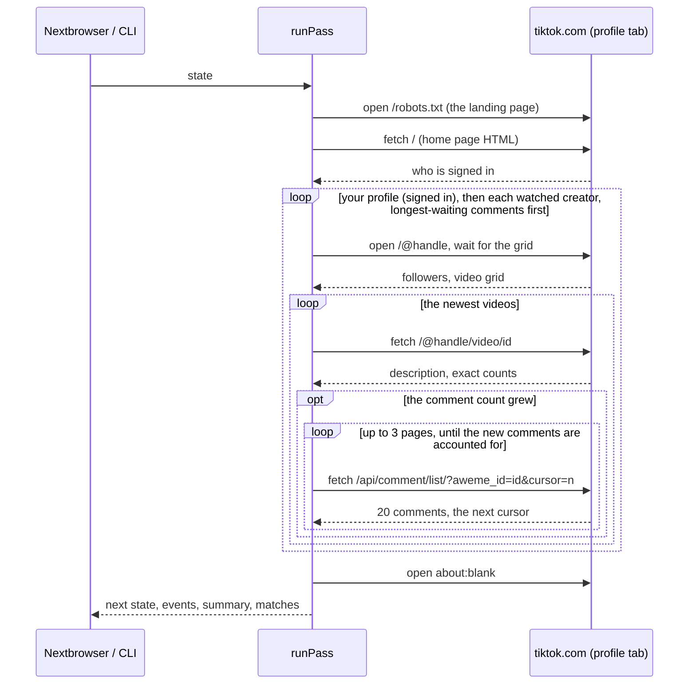

# How it works

A **pass** is one look at TikTok through a Nextbrowser profile. It takes the saved state in and returns the next state, the events, a summary, and the matches it found. It never changes the state it was given. A pass that is stopped or crashes halfway therefore leaves the last saved state intact, and a pass that finishes returns everything it learned.

The pass itself never waits longer than the pause between two pages, or the twenty seconds a creator page is given to draw. When the next pass runs is up to the caller: the Nextbrowser app or the CLI.

## Reading tiktok.com

tiktok.com renders every page on its server and ships the data it drew the page from in one JSON block, `<script id="__UNIVERSAL_DATA_FOR_REHYDRATION__">`. Under `__DEFAULT_SCOPE__` it holds, by page:

| Key | Holds | On |
| --- | --- | --- |
| `webapp.app-context` | `user`: the signed-in account's `uid`, `uniqueId` and `nickName`, or nothing when signed out | every page |
| `webapp.user-detail` | `statusCode` and `userInfo`: the creator's `user` (`id`, `uniqueId`, `nickname`, `privateAccount`) and `stats` (`followerCount`, `followingCount`, `heartCount`, `videoCount`) | a creator's page |
| `webapp.video-detail` | `statusCode` and `itemInfo.itemStruct`: `id`, `desc`, `createTime`, `author.uniqueId`, `stats` (`playCount`, `diggCount`, `commentCount`, `shareCount`, `collectCount`) | a video's page |

The monitor reads that block rather than the API calls the web app makes after the page loads. Those calls carry signatures (`msToken`, `X-Bogus`) that TikTok's own scripts compute, and the monitor does not forge them. TikTok has sent the counts both as numbers (`stats`) and as digit strings (`statsV2`); either is read.

Video, comment and user ids are 19-digit numbers, wider than a JavaScript number holds exactly. They are kept as strings everywhere, and the page scripts quote any that arrive unquoted before `JSON.parse` would round them.

The tab lands on `https://www.tiktok.com/robots.txt`, the lightest page on the same origin, with none of the web app's scripts. A tab that is already on tiktok.com is used as it is. Each answer is cut down inside the page to the fields the monitor uses, so a page's full HTML never crosses CDP.

None of this is a public API. The layout of the block and the `data-e2e` attributes below are what tiktok.com's web app is known to serve, and they change without notice. Every script reports what came back — data, a captcha, a rate limit, a page without data — instead of assuming.

## 1. Account

The pass fetches the home page (`/`) from the tab and reads `webapp.app-context.user`.

| What the page says | What the pass does |
| --- | --- |
| An account | Continues. The first pass, and the first pass after a sign-out, emit `signed_in`. |
| A different account than last time | Emits `account_changed`. The comments on the account's own videos start over as a baseline, because another account has other videos. |
| No account (signed out) | Emits `signed_out` once, and sets `loginRequired` when `watchOwnVideos` is on. The account's own videos and mentions of it wait for a sign-in; the watched creators are read as usual, since their pages are public. |
| No data block at all, such as an error page | Neither signed in nor out: the account stays what it was, a note says why, and the creators are read. |
| HTTP 403 or 451 | Stops the pass. TikTok answers a whole country this way where it is not available, so a proxy there gets it on every page. |

Unlike Instagram, a signed-out profile is not the end of a pass.

## 2. Creators: the supported browser flow

A creator is read the way a person looks at them: the pass opens `https://www.tiktok.com/@handle` in the tab. That is the one flow tiktok.com serves to any browser, signed in or not.

The pass reads your own profile first, then the creators in the order they were added. The exception is a creator whose comments had to wait for a later pass (see [comments](#4-comments)): the creators holding the longest-waiting comments go first. Comments are read from their creator's page, so this order is per creator; without it, a busy video early in the order would spend the pass's comment reads every time, and the creators after it would wait until their comments aged out.

The data block arrives with the HTML, but the video grid does not: the web app draws it afterwards from its own call. So after the page loads, the pass asks every half second, for up to twenty seconds, whether the page has drawn what it needs:

- the grid, `[data-e2e="user-post-item"]`;
- or a state in which no grid will come: a `statusCode` that is not 0, a private account, a creator with no videos;
- or the captcha.

Then one read takes the creator's counts from `webapp.user-detail` and the videos from the grid: each cell's link (`a[href*="/video/"]`) gives the video id, `[data-e2e="video-views"]` the view count as printed ("12.3K"), `[data-e2e="video-card-badge"]` marks a pinned video, and the cover's `alt` text carries the description.

| What the page shows | What the pass does |
| --- | --- |
| A grid | Reads it, and goes on to the videos. |
| `statusCode` 10202 or 10221 | Notes "@handle was not found on TikTok" and goes on with the next creator. |
| `statusCode` 10222, or a private account with no grid | Records the follower count, notes that the account is private, and goes on. |
| A profile whose data is there but whose grid never drew | **Fallback:** records the follower count from the data, notes "TikTok drew no video grid for @handle (captcha, login prompt or a slow page); videos are read next pass", and leaves the creator's videos as they were. |
| Nothing at all: no data, no grid | Notes that TikTok drew nothing, and goes on. |
| The captcha | Stops the pass (see [degraded states](#degraded-states)). |

A grid without the data block still counts: the videos are read, and only the follower count is missing.

## 3. Videos

The grid lists pinned videos first, whatever their age. A video id, though, carries the second it was posted in its top 32 bits (`BigInt(id) >> 32n`), so the pass picks each creator's newest `videosPerCreator` videos (3 by default; `ownVideos`, 6, for your own) by id, without opening any of them.

For each of those it fetches the video's page, `/@handle/video/id`, from the tab, and reads `webapp.video-detail`: the description, when it was posted, and the exact views, likes, comments, shares and saves.

**Fallback:** when the page serves no data block, the video keeps what the grid said: the time from its id, the grid's rounded view count, and the cover's alt text as its description. It is marked `partial`, its other counts stay what they were, and the pass notes how many video pages served no data.

Every video in the grid becomes an item, newest or not, so a creator who posted four videos between two passes has all four reported.

## 4. Comments

A comment list is the expensive read, and the one TikTok guards most. The pass reads one only when the video's comment count grew since it last looked:

- Every watched video has a **watermark**: its comment count when its comments were last read, or when it was first seen, and the time it was taken.
- A count above the watermark means there is something new. The pass reads the list and moves the watermark up.
- A video posted after the source's starting line has a watermark of 0: every comment on it is new.
- A video whose page served no data has no exact count, so its watermark waits for a pass that gets one.

The list is the call the web app makes when its comment panel opens and as it is scrolled: `/api/comment/list/?aweme_id={id}&count=20&cursor={n}&aid=1988`, with the profile's cookies. It answers `{status_code, total, cursor, has_more, comments: [{cid, text, create_time, digg_count, reply_comment_total, user: {unique_id, nickname}}]}`.

**Paging.** The list comes in TikTok's own order, not newest first, so a new comment with no likes can sit pages below the top on a busy video. The pass asks for page after page, from the cursor each page returns, until the comments written after the watermark's time account for what the count grew by, or the list ends. Then the watermark moves to that count.

One video gets at most 3 pages a pass. A busy video that needs more keeps its old watermark and a **backlog**: where the list stopped, and how many new comments were found so far. The next pass goes on from there, and the pass notes "N busy videos have more new comments than one pass reads". After 3 passes on the same backlog the pass gives up on the rest, moves the watermark on, and says so, so that a list that never accounts for its count is not paged on every pass for good.

**The budget.** One pass asks for at most `maxCommentReads` pages (10 by default), across every video; a busy video's later pages count too. A video past that keeps its old watermark and is read on the next pass, so nothing is skipped, only delayed. The pass notes how many videos wait. A waiting video is read before the ones that did not wait, and its creator's page is opened first, so the same busy video cannot starve the others pass after pass.

**The watermark moves last.** The comments a read returns become events only once the creator's videos have all been read. Until then the watermark stays where it was: a pass cut short in between — a rate limit on the next page, Stop, a tab that closed — leaves the old watermark, and the next pass reads those comments again instead of losing them.

**An empty list.** A first page with no comments for a video whose count grew is a list that is turned off or held for review, or TikTok's refusal in a quieter form. One such video is skipped alone, with its old watermark, and the other videos are read. After 3 passes in a row the pass moves its watermark to the count and notes why, so it is not asked for again until more comments arrive. A second video coming back empty in the same pass is taken for TikTok's refusal, below, and counts against neither video.

**Fallback:** the web app signs this call, and the monitor does not. On a creator's page, where the web app is running, TikTok's own scripts may sign it on the way out; when nothing does, TikTok is known to answer with nothing, with a page, or with a non-zero `status_code`. The pass treats any of these, and empty lists from two videos in one pass, as a refusal:

- it notes "TikTok did not answer the comment list without its own signature; comments were skipped this pass (see troubleshooting)";
- it sets `summary.commentsRefused`, and logs the answer;
- it asks for no other list in that pass, since TikTok answers every one the same way;
- every watermark stays where it was, so a later pass that gets an answer reads what was missed.

The rest of the pass — new videos, counts, followers — goes on.

Freshness is judged by each comment's own `create_time`, so a comment that surfaces in a later read is still announced while it is inside `maxItemAgeMs`.

TikTok has no stable link to one comment: the web app opens a video and its comment panel, never a single comment. A comment's link is therefore the video it is under.

## 5. Sources and what counts as new

A **source** is one stream of items:

| Source | Key | Holds |
| --- | --- | --- |
| Comments on your videos | `comments:own` | Every new comment under your newest videos. |
| A creator's videos | `creator:<handle>:videos` | Every video in the creator's grid. |
| Comments under a creator's videos | `creator:<handle>:comments` | New comments under the creator's newest videos. |

The first time a source is read, what it holds is its **starting line**: the pass records the time and announces nothing from it. From then on, an item is new when:

- the pass has not seen it before (the state keeps the last 5,000 item keys, across all sources; a key seen again moves to the newest end, so an item still on show is not forgotten and announced twice);
- it was created after the source's starting line;
- it is not older than `maxItemAgeMs` (72 hours by default: comments keep arriving on TikTok for days after a video is posted).

A source whose keyword set changes gets a new starting line. A source that is removed from the settings is forgotten, so adding it back starts over too. The account's own source is kept while the profile is signed out, so the same account picks up where it left off after a sign-in.

New items are emitted as `new_item` events, oldest first within each source.

## 6. Keywords and mentions

Keywords are words, phrases or hashtags. An item matches a keyword when the keyword appears in its text — a video's description, or a comment:

- as a whole word or phrase: "acme" is found in "#acme" and "@acme", not in "#acmeshop";
- case-insensitively, in any script;
- with any run of spaces or line breaks inside a phrase.

A **mention** is the account's `@handle` in the text, as a whole handle: "@acme." ends a sentence, "@acme_shop" and "@acme.eu" are somebody else. A comment that opens with `@handle` is how a reply to the account reads on TikTok, and is called a reply.

**Exclusion words** drop an item even when a keyword matched, unless it is addressed to the account.

| Source | Reported when |
| --- | --- |
| Comments on your videos | Always. They are addressed to the account. |
| A creator's videos | Always. A creator you watch posting is the news; keywords only add to the ranking. A description that mentions you is ranked as a mention. |
| Comments under a creator's videos | Only when they name a keyword or mention the account. These lists are read only when there is a keyword or a signed-in account to look for. |

The account's own videos and comments are never reported.

### Why there is no keyword search

TikTok's search runs only through signed calls, and a browser that searches repeatedly is the first thing it puts a captcha in front of. A monitor that searched every pass would spend most passes behind one. So the monitor does not search TikTok. It watches the creators where the conversation about you happens — competitors, partners, the accounts your customers follow — and finds your keywords and your handle there. Add the creators whose comment sections matter to you.

## 7. Urgency triage

Every match is ranked by a few fixed rules. Each rule adds points and a reason in plain words:

| Rule | Points | Reason shown |
| --- | --- | --- |
| Mentions the account, or replies to it | +4 | "Mentions you", "Replies to you" |
| Comments on the account's own video | +2 | "Comments on your video" |
| Says an urgent term (`urgentTerms`, e.g. "refund", "broken", "never arrived"), in an item addressed to the account or naming a keyword | +3 | `Says "refund"` |
| Asks a question: a question mark, or a comment that starts with a question word | +1 | "Asks a question" |
| A comment on the account's video with no replies yet | +1 | "No reply yet" |
| A video whose views jumped since the last look, past the engagement threshold | +1 | "Picking up fast: +12K views since the last look" |

Four points or more is **high**, two or three is **medium**, anything else is **low**. So a mention or a reply is always high; a question on your video with no reply is high; a plain comment on your video is medium; a keyword comment under a competitor's video is low unless it says something urgent.

The rules are few and fixed on purpose. A person deciding what to answer first has to be able to see why the monitor put an item on top, and so does anyone reading the code before trusting it with their account. No model is involved, and nothing is sent anywhere.

An urgent term counts only in an item that is about you. "My order never arrived" under a competitor's video is the competitor's problem unless it names one of your keywords.

`urgentTerms` has a default list in [`src/triage.ts`](../src/triage.ts). A team replaces it with its own words: an empty list is a valid choice and turns the rule off.

## 8. Engagement

Every watched video keeps its last counts and a short history of its views (48 samples). When a video's page is read again, the pass compares:

| Metric | A jump is | Default |
| --- | --- | --- |
| Views | at least `viewsMin` more, and at least `viewsRatio` of the last reading | +1,000 and +50% |
| Likes | at least `likesMin` more, and at least `likesRatio` of the last reading | +500 and +50% |
| Comments | at least `commentsMin` more | +20 |

A jump emits `engagement_changed`, for your videos and the creators' alike. A creator's video whose views jumped also carries the "Picking up fast" reason on the dashboard. A reading from the grid is rounded, and an event that compares one is marked `approximate`.

Follower counts come with every profile read, so they cost no request of their own. A change emits `followers_changed`, and the history keeps the last 200 changes.

## 9. Parking the tab

Once the reads are done, the pass opens `about:blank`, so no TikTok page is left playing video or polling between passes. Set `parkTab: false` to keep the page.

## Degraded states

| What happens | What the pass does | Summary |
| --- | --- | --- |
| The captcha: `#captcha-verify-container` or `.captcha_verify_container` on the page, `/verify` or `captcha` in the address, or "Verify to continue" on a page without data | Stops. Emits `security_check`. The next pass should wait three intervals. | `securityCheck`, `blocked` |
| HTTP 429, a "too many requests" answer, or a `status_code` from 10000 to 10099 | Stops early. The rest is read next time, after three intervals. | `rateLimited`, `blocked` |
| No answer at all: a network error or a 20-second timeout | Stops. | `blocked` |
| HTTP 403 or 451 on the home page | Stops: TikTok is not available through this proxy's country. | `blocked` |
| A creator not found, private, or drawn without a grid | Notes it and goes on with the next creator. | `notes` |
| A video page without data | Uses the grid's figures and goes on. | `partialVideos` |
| A comment list TikTok will not answer, or empty lists from two videos | Skips comments for the pass, keeps the watermarks, goes on. | `commentsRefused` |
| An empty list from one video whose count grew | Skips that video, keeps its watermark, reads the others; moves the watermark on after 3 passes, with a note. | `notes` |
| A busy video with more new comments than 3 pages | Keeps its watermark and goes on from where it stopped next pass. | `commentReadsUnfinished` |
| Something unexpected: a browser or CDP error | Stops, with the error in a note. | `failed` |
| A signed-out profile | Reads the public creators; your own videos wait. | `signedIn: false`, `loginRequired` |

A pass that stops keeps everything it read before the stop, and every source it did not reach keeps its old state. Comments read from a creator whose read the stop interrupted are not announced, and their watermarks stay where they were, so the next pass reads them again. Each of these has an entry in [troubleshooting](troubleshooting.md).

## What it never does

The engine only reads. It never likes, comments, replies, follows, shares, saves or sends a message, and it never clicks, types or scrolls. No script it runs uses any method but `GET`. It keeps no network connections, timers, or files of its own: everything goes through the browser and the state it is handed.
