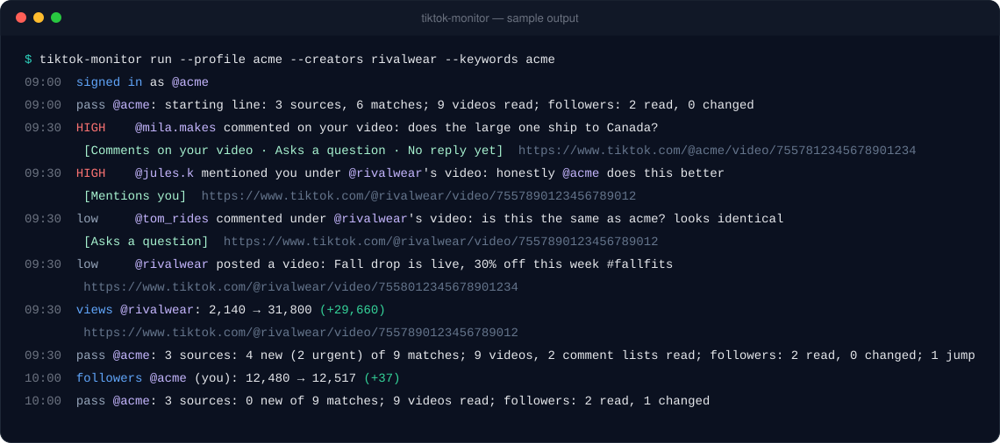
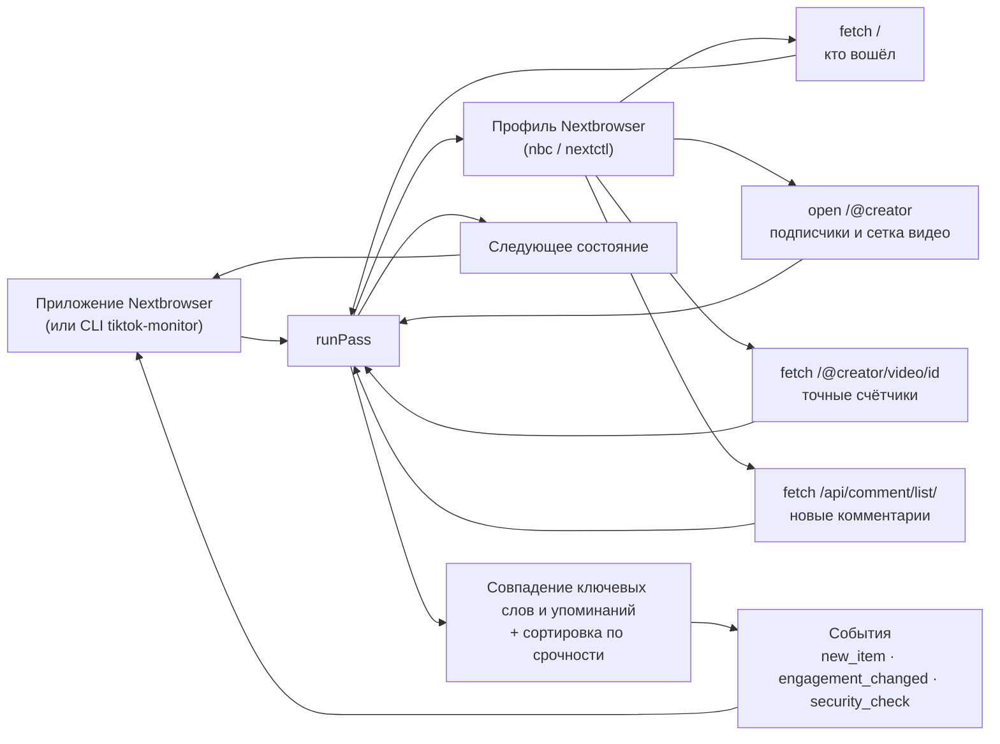

<p align="center">
  
</p>

<h1 align="center">Nextbrowser TikTok Monitoring</h1>

<p align="center">
  <strong>Открытый движок мониторинга TikTok для Nextbrowser: новые видео и комментарии авторов, за которыми вы следите, комментарии под вашими видео, упоминания, ключевые слова и всплески вовлечённости, отсортированные по тому, насколько срочно нужен ответ, — прямо из вашего браузерного профиля.</strong>
</p>

<p align="center">
  <a href="https://nextbrowser.com/">Сайт</a> ·
  <a href="https://github.com/nextbrowser-oss/nextbrowser-app">Приложение Nextbrowser</a> ·
  <a href="https://docs.nextbrowser.com/">Документация продукта</a> ·
  <a href="../../how-it-works.md">Как это работает</a> ·
  <a href="https://discord.com/invite/gHXEvkGXnz">Discord</a>
</p>

<p align="center">
  <a href="https://github.com/nextbrowser-oss/nextbrowser-tiktok-monitoring/actions/workflows/ci.yml"></a>
  <a href="../../../LICENSE"></a>
  
  
  <a href="https://github.com/nextbrowser-oss/nextbrowser-app"></a>
</p>

<p align="center">
  <a href="../../../README.md">English</a> ·
  Русский
</p>

<p align="center">
  
</p>

## Зачем нужен Nextbrowser TikTok Monitoring

Этот пакет — движок, на котором работает мониторинг TikTok в [Nextbrowser](https://github.com/nextbrowser-oss/nextbrowser-app). Он работает внутри приложения, в браузерном профиле, где открыт tiktok.com, и за каждый проход отвечает на четыре вопроса:

- кто прокомментировал ваши видео, ответил вам или упомянул вас;
- что опубликовали авторы, за которыми вы следите, и где под их видео всплыли ваши ключевые слова;
- какие видео внезапно набирают просмотры, лайки или комментарии;
- на что из этого нужно ответить в первую очередь.

Код открыт, потому что движок работает с вашим собственным профилем и — если выполнен вход — с вашим аккаунтом. Любой может прочитать, какие именно страницы он открывает, что из них сохраняет и как решает, что срочно.

- **Только чтение.** Он никогда не ставит лайки, не комментирует, не отвечает, не подписывается и не делится. Он открывает страницы и читает их; ничего не нажимается, не вводится и не прокручивается.
- **Работает и без входа.** Страница автора публична, поэтому авторы, за которыми вы следите, читаются, даже если в профиле не выполнен вход. Вход добавляет ваши собственные видео, комментарии под ними и упоминания вашего аккаунта.
- **Объяснимая сортировка.** Шесть фиксированных правил ставят каждому совпадению уровень *high*, *medium* или *low*, и к каждому прилагаются причины обычными словами. Никакой модели, и ничего не уходит с машины.
- **Хозяин — приложение.** У движка нет своих таймеров, файлов и сетевых соединений. Nextbrowser запускает проход, хранит состояние и решает, что показать.

## От упоминания до одобренного ответа

Мониторинг — это половина TikTok-скилла в Nextbrowser. Вторая половина — TikTok reply agent:

| Шаг | Где | Что происходит |
| --- | --- | --- |
| 1. Поиск упоминаний и контента | этот движок | Ваши свежие видео и комментарии под ними, новые видео каждого отслеживаемого автора и комментарии под ними — всё сверяется с ключевыми словами и вашим @handle как с целыми словами. |
| 2. Сортировка по срочности | этот движок | Каждое совпадение получает ранг: упоминает вас или отвечает вам, комментирует ваше видео, содержит срочное слово вроде «refund» или «broken», задаёт вопрос, ещё без ответа или находится под видео, которое быстро набирает обороты. |
| 3. Черновик ответа | TikTok reply agent в Nextbrowser | Нажмите **Draft reply** у совпадения. Агент открывает видео, читает комментарий и контекст и пишет ответ именно на этот комментарий, а не шаблонную фразу. |
| 4. Режим одобрения | TikTok reply agent в Nextbrowser | Черновик сначала показывается вам в чате. Ничего не публикуется, пока вы его не одобрите; его можно отредактировать или отклонить. |

Движок намеренно останавливается на шаге 2: что бы он ни нашёл, что сказать в ответ, решает человек. [Пошаговый пример](../../walkthrough.md) проводит один комментарий через все четыре шага.

## Основные возможности

| Область | Что доступно |
| --- | --- |
| Ваши видео | Ваши свежие видео (по умолчанию 6) и каждый новый комментарий под ними — после входа в профиле. Комментарий, который начинается с вашего @handle, — это ответ вам. |
| Авторы | До 10 авторов: конкуренты, партнёры, аккаунты, которые смотрят ваши клиенты. Сообщается о каждом новом видео; их свежие видео (по умолчанию 3) открываются ради точных счётчиков и новых комментариев. |
| Упоминания и ключевые слова | Ваш @handle в любом месте комментария или описания. До 20 ключевых слов или хэштегов, без учёта регистра, как целые слова («acme» находится в «#acme», но не в «#acmeshop»). Слова-исключения отсекают шум. |
| Вовлечённость | Просмотры, лайки или комментарии отслеживаемого видео резко выросли с прошлого раза — сверх порогов, которые вы задаёте (по умолчанию +50% и не меньше 1 000 просмотров). Число подписчиков вашего аккаунта и каждого автора. |
| Сортировка по срочности | *high*, *medium* или *low* с причинами — по правилам, которые можно прочитать в [`src/triage.ts`](../../../src/triage.ts). Срочные слова — это настройка; они учитываются только там, где есть обращение к аккаунту или упомянуто ключевое слово. |
| Деградированные состояния | Капча, лимит запросов, профиль без входа, приватный или несуществующий автор, страница без сетки видео, список комментариев, на который TikTok не отвечает: у каждого случая — понятная заметка, флаг в сводке и раздел в [решении проблем](../../troubleshooting.md), а проход продолжается там, где это возможно. |
| Встраиваемое ядро | `runPass(state) → { state, events, summary, matches }` без зависимости от Node, поэтому работает в рендерере Nextbrowser. |
| Отдельный CLI | `tiktok-monitor` управляет любым профилем Nextbrowser через `nbc`/`nextctl` — для разработки и для работы без приложения. |

## В Nextbrowser

Nextbrowser поставляет движок как зависимость и даёт ему три вещи:

- браузер, которым приложение уже управляет для выбранного профиля;
- место для хранения состояния;
- таймер.

```ts
import { normalizeState, runPass, scheduleDelay, withSettings } from "@nextbrowser-oss/tiktok-monitoring";

const saved = withSettings(normalizeState(await load()), { creators: ["rivalwear"], keywords: ["acme", "#acmewear"] });
const { state, events, summary, matches } = await runPass({
  browser: cliBrowser(profileArgs),          // the app's nextctl-backed browser for the profile
  state: saved,
  onEvent: (event) => notify(event),         // new_item, engagement_changed, security_check, ...
});
await save(state);
show(matches);                               // most urgent first, with the reasons
setTimeout(next, scheduleDelay(30 * 60_000, { backOff: !!summary.blocked }));
```

Контракт между приложением и движком описан в [руководстве по интеграции](../../integration.md).

## Запуск отдельно

Чтобы разрабатывать движок или запускать его без приложения, используйте встроенный CLI. Нужны Node.js 22 или новее и профиль Nextbrowser. Авторы, за которыми вы следите, читаются и без входа; для ваших собственных видео и упоминаний войдите в профиле в tiktok.com. CLI использует бинарник `nextctl`, которым управляет приложение, или `nbc` из `PATH`.

```bash
git clone https://github.com/nextbrowser-oss/nextbrowser-tiktok-monitoring.git
cd nextbrowser-tiktok-monitoring
npm ci
npm run build
node dist/node/bin.js run --profile <your-profile> --creators <creator1>,<creator2> --keywords "<brand>,#<hashtag>"
```

Чего ожидать:

1. Первый проход записывает содержимое каждого источника как стартовую линию и ни о чём не сообщает.
2. Каждый следующий проход печатает новые совпадения — самые срочные с пометкой `HIGH`, с причинами и ссылкой — и ждёт около получаса (`--interval`).
3. Остановите его <kbd>Ctrl</kbd>+<kbd>C</kbd>. Следующий запуск продолжит с сохранённого состояния в `~/.nextbrowser/tiktok-monitoring/<profile>.json`.

Если направить вывод в другую программу, он переключается на JSON Lines — одно событие на строку. Все флаги перечислены в [справочнике CLI](../../cli-reference.md), а [пошаговый пример](../../walkthrough.md) проводит через первую сессию шаг за шагом.

## Как это работает



Каждый проход делает пять вещей по порядку:

1. Открывает tiktok.com во вкладке и читает, кто вошёл.
2. Открывает ваш собственный профиль, если выполнен вход, и читает ваши свежие видео.
3. Открывает профиль каждого отслеживаемого автора и читает его сетку видео.
4. Для свежих видео загружает их страницы ради точных счётчиков и читает список комментариев каждого видео, у которого выросло их число.
5. Паркует вкладку.

На странице [«Как это работает»](../../how-it-works.md) подробно описано:

- как элемент признаётся новым и почему первое чтение ни о чём не сообщает;
- почему список комментариев читается, только когда их число выросло;
- каждое правило сортировки и его вес;
- что происходит при капче, лимите запросов или списке комментариев, на который TikTok не отвечает.

## Документация

- [Пошаговый пример](../../walkthrough.md): первая сессия от настройки до одобренного ответа, с настоящим выводом.
- [Как это работает](../../how-it-works.md): проход шаг за шагом, правила новизны, сверка ключевых слов, сортировка по срочности, вовлечённость, деградированные состояния.
- [Руководство по интеграции](../../integration.md): контракт с приложением Nextbrowser, Node-адаптер, установка пакета.
- [События и состояние](../../events-and-state.md): все события, документ состояния и настройки.
- [Справочник CLI](../../cli-reference.md): команды, флаги, вывод и коды выхода `tiktok-monitor`.
- [Решение проблем](../../troubleshooting.md): капча, лимит запросов, отказ в списке комментариев, сетка, которая не отрисовывается, профиль, который не запускается.

## Статус проекта

Это ранний выпуск (`0.x`). Известные ограничения:

- **Ещё не проверен вживую.** Веб-данные TikTok не документированы. Блок данных, атрибуты `data-e2e` сетки и формат списка комментариев соответствуют тому, что, как известно, отдаёт веб-приложение tiktok.com, и каждое чтение покрыто тестами на подставных страницах такого вида, но из этого пакета ничего из этого ещё не запускалось на tiktok.com. Первые живые запуски, скорее всего, потребуют исправлений; на странице [решения проблем](../../troubleshooting.md) сказано, что для этого собрать.
- **В комментариях может быть отказано.** Веб-приложение TikTok подписывает свои запросы списка комментариев. Монитор делает этот запрос без подписи, и TikTok может ничего не ответить. Тогда комментарии пропускаются на этот проход с заметкой, а остальной мониторинг продолжается.
- **Нет поиска по всему TikTok.** Поиск требует подписанных запросов и быстро вызывает капчу, поэтому монитор не ищет. Вместо этого он следит за авторами, у которых идёт разговор о вас.
- **Первые 20 комментариев.** Список комментариев читается на одну страницу вглубь, в собственном порядке TikTok, а не от новых к старым. На очень популярном видео новый комментарий можно пропустить.
- **У комментариев нет своих ссылок.** В TikTok нет устойчивой ссылки на отдельный комментарий, поэтому ссылка комментария — это видео, под которым он оставлен.

Предложения и баги — в [GitHub Issues](https://github.com/nextbrowser-oss/nextbrowser-tiktok-monitoring/issues). Issue — это предложение, а не обязательство выпустить.

## Участие в разработке

Прочитайте [CONTRIBUTING.md](../../../CONTRIBUTING.md), прежде чем открывать изменение. Держите изменения сфокусированными. Любое изменение того, что читается с tiktok.com, или того, как ранжируется совпадение, должно сопровождаться тестами. Изменение README должно обновлять и [русскую версию](README.md).

## Сообщество и поддержка

- Присоединяйтесь к [Discord Nextbrowser](https://discord.com/invite/gHXEvkGXnz): общение, помощь с настройкой и новости продукта.
- Общие вопросы задавайте в [Nextbrowser Discussions](https://github.com/nextbrowser-oss/nextbrowser-app/discussions).
- [GitHub Issues](https://github.com/nextbrowser-oss/nextbrowser-tiktok-monitoring/issues) — для конкретной, ограниченной по объёму работы.
- Об уязвимостях сообщайте приватно по [SECURITY.md](../../../SECURITY.md). Не публикуйте детали уязвимостей в issue.

## Ответственное использование

Отслеживайте только аккаунты, которыми вы владеете или управлять которыми вам разрешено, и соблюдайте [Условия обслуживания TikTok](https://www.tiktok.com/legal/terms-of-service) и [Правила сообщества](https://www.tiktok.com/community-guidelines). Монитор намеренно соблюдает темп:

- не меньше десяти минут между проходами (по умолчанию тридцать), и незавершённый проход задерживает следующий;
- пауза от трёх до семи секунд перед каждой открываемой страницей и от полутора до четырёх секунд перед каждым запросом, как у человека, переходящего между страницами;
- остановка при капче или лимите запросов и ожидание трёх интервалов перед следующей попыткой;
- не больше 10 авторов, 20 ключевых слов, 10 видео на автора и 30 списков комментариев за проход.

Не снимайте эти ограничения ради массового сбора данных и не используйте монитор для сбора сведений о людях. Не используйте найденное для непрошеных или однотипных ответов: TikTok за это ограничивает и блокирует аккаунты.

## Лицензия

Nextbrowser TikTok Monitoring — открытое программное обеспечение под лицензией [GNU Affero General Public License v3.0 only](../../../LICENSE).

AGPL-3.0 разрешает коммерческое использование, изменение и распространение. Если вы распространяете изменённую версию или запускаете её как сетевой сервис, лицензия требует предоставить соответствующий исходный код на тех же условиях. Зависимости этого репозитория остаются под своими лицензиями.

Copyright © 2026 Nextbrowser contributors.
